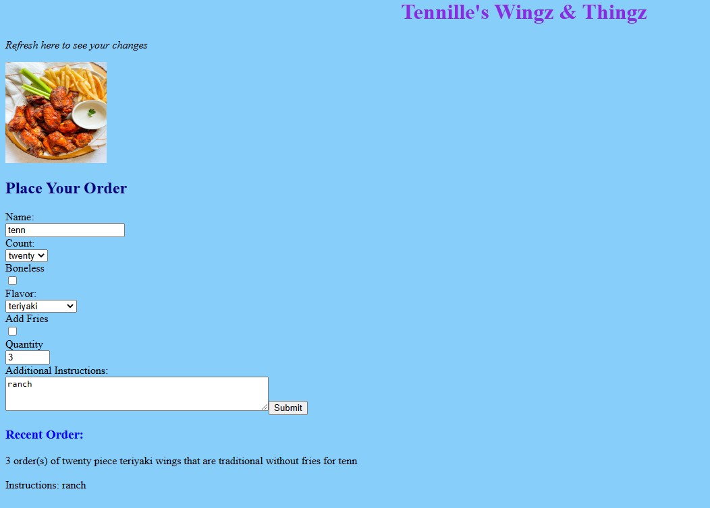

<a href="https://github.com/TennWilliams/HTML-Food-Order-Form"> HTML Order Form </a>
## Wingz & Things Order Form

In this exercise I created an eye that follows the mouse cusor by using CSS to create and styling the eye and JavaScript function on mouse move to make the eyes move around the creeen as you move your mouse cusor.  

Future improvments to this exercise is to add click effect to buttons and hoover message to input box.

You can view this project by clicking on the following link <a href="https://tennwilliams.github.io/HTML-Food-Order-Form/"> Wingz & Things Order Form </a> 

License through MIT
